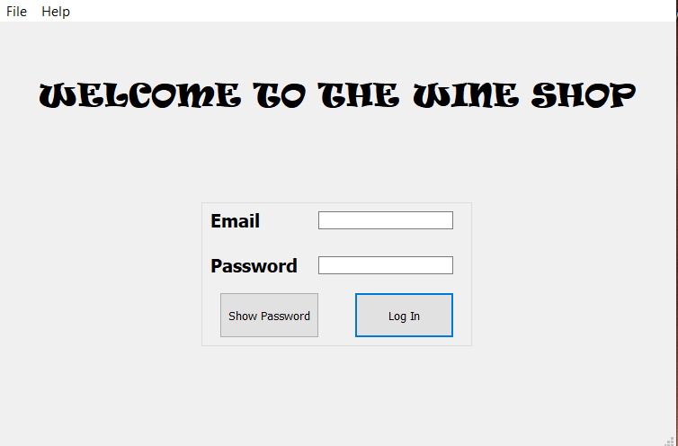
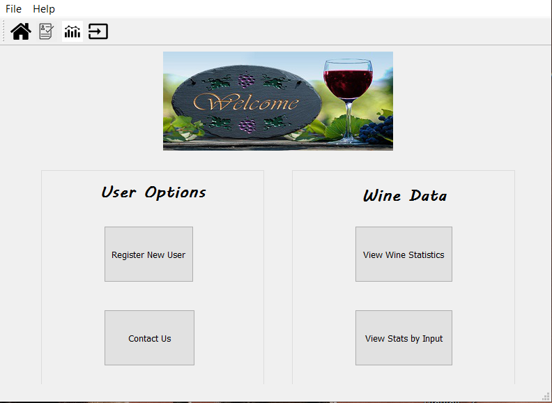
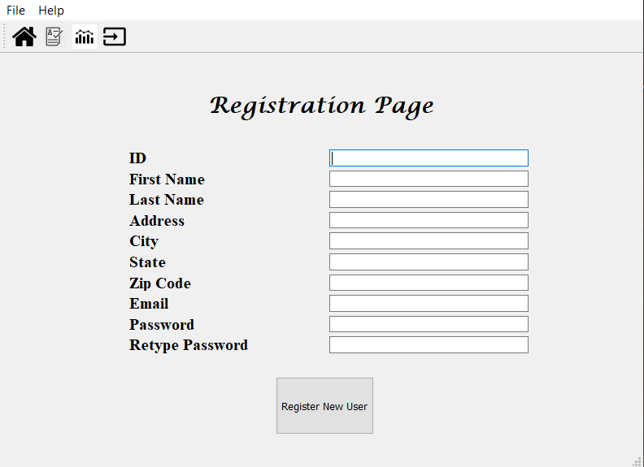
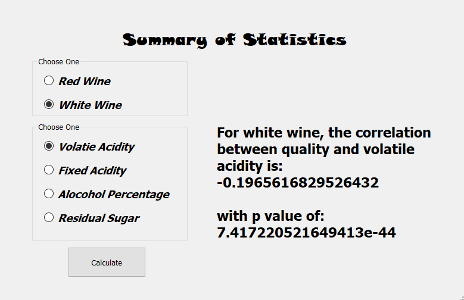

# Wine Data Application

The purpose of project is to create a working desktop app where a company could safely have their employees log in and either register new users, view data statistics, or find information about the company. The wine data is in a CSV file, and the database containing the user accounts is processed using SQLite3. The app was made using PYQT.

All other image files are resources that the application will use for logos and styles. '

Project was never completed. <b>Still needs to render charts in app, as right now charts only render in compiler console.</b>

Pictures of the project are included below.

## Landing Page

## Main Page

## Registration Page

## Wine Analysis Page

